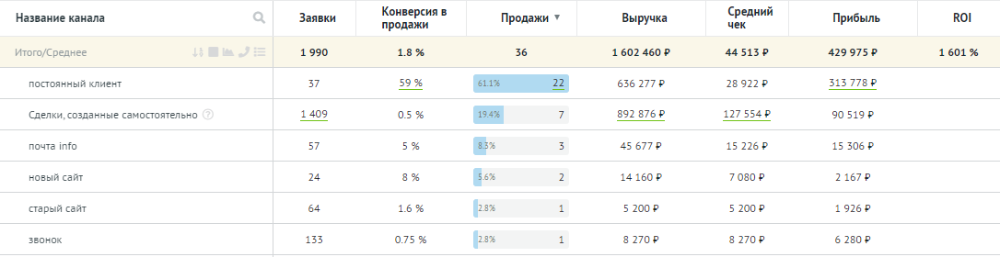

https://github.com/code4-fun/bitrix24_analytics_report_Laravel_Vue3/assets/72479131/b423d8ed-74f3-471e-9f59-e80200cef5e2


## Используемые технологии

- Bitrix24

- Laravel

- Vue 3

- Pinia

- Docker

- TypeScript

## Задача

Стек: Laravel + Vue.js

1. Создать личный кабинет на Laravel с отчетом по сделкам из Б24

2. Создать тестовый портал Б24

3. Разработать интеграцию личного кабинета с Б24

4. Загружать все лиды и сделки из Б24
 
5. В кастомном поле dailygrow в карточке лида/сделки Б24, указывать источник сделки вручную, чтобы подтягивать в отчет.

6. Построить отчет по лидам/сделкам в личном кабинете

Пример отчета из Б24



Название канала - значение поля dailygrow из Б24  
Заявки - лиды/сделки созданные в Б24 за выбранный период  
Продажи - сделки со статусом успешно завершены в Б24  
Выручка - сумма сделок в Б24  
Средний чек - количество сделок / на сумму сделок  
Прибыль - значение поля прибыль в Б24  

Лиды в б24 - подгружаются в качестве зяавок, но поле выручки и прибыль не учитываются в аналитике. 

## Запуск проекта в Docker

Выполнить команды

```
git clone https://github.com/code4-fun/bitrix24_analytics_report_Laravel_Vue3.git

cd bitrix24_analytics_report_Laravel_Vue3

cp .\backend\.env.example .\backend\.env (для Windows CMD)

cp ./backend/.env.example ./backend/.env (для Linux)

docker-compose up -d

docker-compose exec php-cli php artisan migrate:fresh --seed

docker-compose exec php-cli php artisan serve
```

После чего приложение будет доступно на: http://localhost:5173

**Учетные данные для входа в систему**

email: `admin@domain.com`  
password: 1

Или можно зарегистрировать своего пользователя
